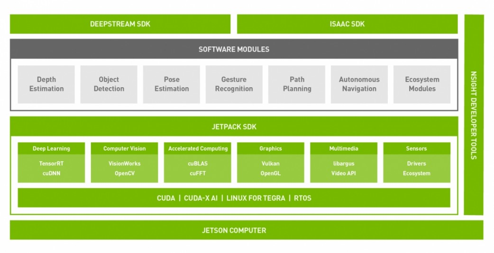

# APLICACION DE ESCRITORIO PARA MONITOREO DE DRONE

Esta aplicacion nos va a permitir interpretar la información que nos envia el drone por medio de xbee.

- Jetson Nano
- PyQt5
- PyQtWebEngine
- Folium

---

## Jetson Nano<br>


- NVIDIA® Jetson Nano™ Developer Kit es una pequeña computadora poderosa que nos permite correr multiples redes neuronales en paralelo, plataforma facil de usar que encience con 5 voltios.
- Caracteristicas :
  - Jetson Nano Module<br>
     - 128-core NVIDIA Maxwell™ GPU - Quad-core ARM® A57 CPU - 4 GB 64-bit LPDDR4 - 10/100/1000BASE-T Ethernet
  - Opciones de encendido
    - Micro-USB 5V 2A
    - DC power adapter 5V 4A
  - I/O<br>
    
    - USB 3.0 Type A - USB 2.0 Micro-B - HDMI/DisplayPort - M.2 Key E - Gigabit Ethernet - GPIOs, I2C, I2S, SPI, UART - 2xMIPI-CSI camera connector - Fan connector - PoE connector

## L4T OS (Linux For Tegra)

- Linux for Tegra (Linux4Tegra, L4T) es una distribucion de software basada en GNU/Linux de Nvidia para la serie de procesadores Nvidia Tegra utilizada en plataformas como la serie de placas de Nvidia Jetson. [[wiki](https://en.wikipedia.org/wiki/Linux_for_Tegra)]
- Incluye :
  - Linux Kernel 4.9,
  - bootloader,
  - NVIDIA drivers,
  - flashing utilities,
  - sample filesystem based on Ubuntu 18.04,
  - and more for the Jetson platform
- Latest release is NVIDIA L4T 32.5, supports all Jetson modules:
  - Jetson AGX Xavier series,
  - Jetson Xavier NX,
  - Jetson TX2 series,
  - Jetson TX1,
  - and Jetson Nano
- Check L4T version used by Jetson Nano using Terminal
  ```
  head -n 1 /etc/nv_tegra_release
  ```
- Result :
  ```
  # R32 (release), REVISION: 5.0, GCID: 25531747, BOARD: t210ref, EABI: aarch64, DATE: Fri Jan 15 22:55:35 UTC 2021
  ```
- `R32` and `REVISION: 5.0` in the log above indicates that the L4T version used is L4T 32.5.
- Check L4T Linux Kernel version,
  ```
  uname -a
  ```

## NVIDIA JetPack SDK

- NVIDIA JetPack SDK es la solucion mas completa para crear aplicaciones de inteligencia artificial. Todos los modulos y kits de desarrollo de Jetson son compatibles con JetPack SDK.
- JetPack SDK incluye el ultimo driver empaquetado de Linux (L4T) con systema operativo Linux, librerias acelerada de CUDA-X y APIs para Deep Learning, Computer Vision, Accelerated Computing y Multimedia. <br>
  
- Latest release JetPack is version 4.5.
- JetPack Caracteristicas :
  - **OS** : NVIDIA L4T (JetPack 4.5 includes L4T 32.5)
  - **CUDA** : es una plataforma de computación paralela y un modelo de programación que utiliza una GPU. (JetPack 4.5 include CUDA 10.2 )
  - **cuDNN** : (CUDA Deep Neural Network) es una libreria GPU-accelerated para deep neural networks. Proporciona implementaciones altamente ajustadas para rutinas estandar como _forward_ and _backward convolution_, _pooling_, _normalization_, and _activation layers_. cuDNN accelerates widely used deep learning frameworks, including **Caffe2**, **Chainer**, **Keras**, **MATLAB**, **MxNet**, **PaddlePaddle**, **PyTorch**, and **TensorFlow** (JetPack 4.5 includes cuDNN 8.0).
  - **TensorRT** : es el tiempo de ejecución de inferencia de deep learning de alto rendimiento , construido sobre cuda (JetPack 4.5 includes TensorRT 7.1.3)
  - **Computer Vision** :
    - VisionWorks version 1.6
    - **OpenCV** (default without CUDA) ver 4.1.1
    - VPI (Vision Programing Interface) ver 1.0
- Check JetPack version en L4T OS,
  ```
  sudo apt-cache show nvidia-jetpack
  ```
- Result,
  ```
  Package: nvidia-jetpack
  Version: 4.5-b129
  Architecture: arm64
  Maintainer: NVIDIA Corporation
  Installed-Size: 194
  ...
  .
  ```
- Puedes ver que la version de JetPack es `4.5-xxx` en `L4T 32.5` .

## Comandos Básicos Linux

- Update & Upgrade software
  ```
  sudo apt-get update
  sudo apt-get upgrade
  ```
- Revisar interfaz de red
  ```
  ifconfig
  ```
- Trabajando con archivos del sistema

  - Lista de contenido en la carpeta actual
    ```
    ls
    ```
  - Listado con detalles
    ```
    ls -lAh
    ```
  - Cambiar o mover de carpeta
    ```
    cd Downloads
    ```
  - Ir a la carpeta home
    ```
    cd ~
    ```
  - Revisar la ruta de la carpeta actual
    ```
    pwd
    ```
  - Crear una carpeta

    ```
    mkdir Test
    ```

  - Crear un archivo
    ```
    touch myfile.txt
    ```
  - Copiar un archivo
    ```
    cp myfile.txt Test
    ```
  - Eliminar un archivo
    ```
    rm Test/myfile.txt
    ```
  - Mover un archivo
    ```
    mv myfile.txt Test
    ```
  - Eliminar una carpeta vacía
    ```
    rmdir Test
    ```
  - Eliminar una carpeta no vacía
    ```
    rm -rf Test
    ```

---

# PyQt5

---

# PyQtWebEngine

---

# Folium

- https://python-visualization.github.io/folium/

---

# Instalacion

- pip install -r requirements

---

# Uso

- python3.7 test6.py
